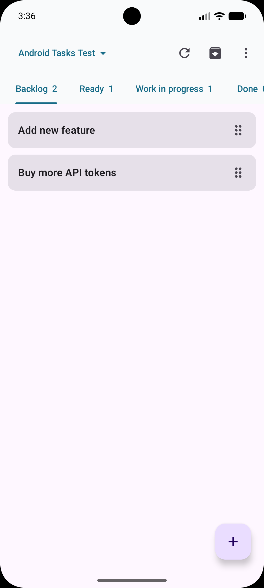
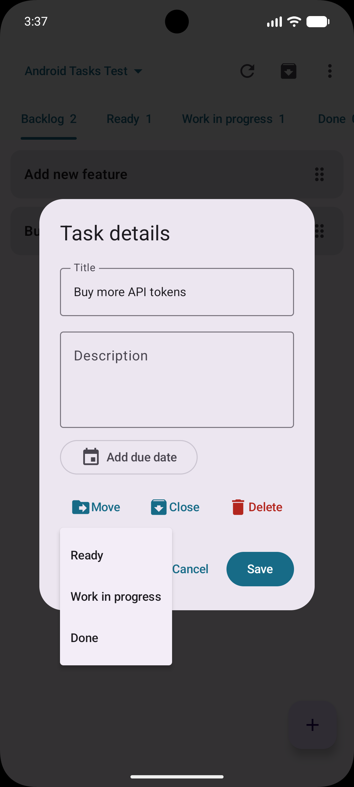
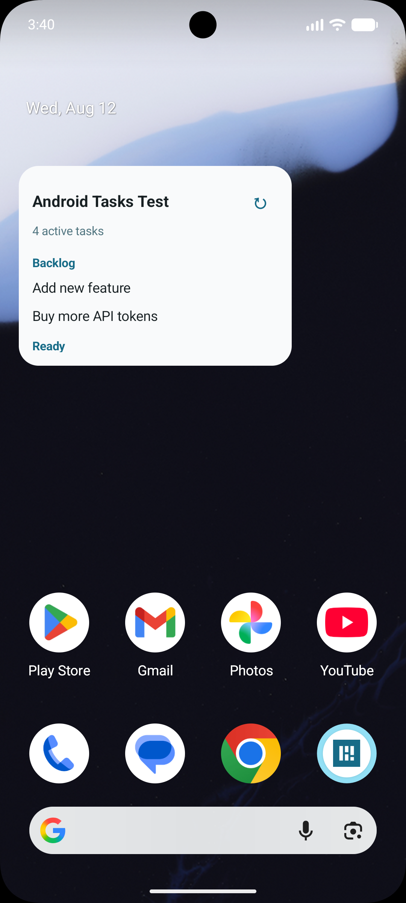

# Kandroid

Kandroid is an independent, open-source Kanban app for Android. It can connect directly to a self-hosted [Kanboard](https://kanboard.org/) instance through the Kanboard JSON-RPC API, or run entirely on-device in local-only mode.

Kandroid is not an official Kanboard application and is not affiliated with or endorsed by the Kanboard project.

## Screenshots

<p align="center">
  
  
  
</p>

## Features

- Connect to a Kanboard server with a username and personal API token.
- Use Kandroid locally without a server or account.
- Browse projects and move between board columns by swiping.
- Create and edit tasks, including descriptions and due dates.
- Move and reorder tasks with controls or long-press drag gestures.
- Close, reopen, and delete tasks.
- Create projects and archive existing projects.
- Read cached projects and tasks while offline.
- Add configurable home-screen widgets for selected projects.
- Refresh connected boards and widgets from Kanboard, or local-only boards directly from the on-device database.
- Export portable JSON backups from either mode and restore them into local-only mode.

## Requirements

- Android 8.0 (API 26) or newer

Kanboard mode additionally requires:

- A Kanboard server available over HTTPS
- A normal Kanboard user account and personal API token

The server address may be either the site root, such as `https://kanboard.example.com`, or its full `jsonrpc.php` endpoint.

## Build from source

The project requires JDK 17 and Android SDK 37. Open it in Android Studio and allow Gradle to sync, or build it from the command line.

On Windows:

```powershell
.\gradlew.bat testDebugUnitTest assembleDebug
```

On Linux or macOS:

```sh
./gradlew testDebugUnitTest assembleDebug
```

The debug APK is written to `app/build/outputs/apk/debug/app-debug.apk`.

## Releases, GitHub, and F-Droid

Release versions are declared statically in `app/build.gradle.kts` so F-Droid can discover and build them from source. Pull requests and updates to `main` are checked by GitHub Actions with unit tests, Android lint, and an unsigned release build.

For each release:

1. Increment `versionCode` and update `versionName`. Never reuse a version code.
2. Add `fastlane/metadata/android/en-US/changelogs/<versionCode>.txt` with release notes of at most 500 characters.
3. From a clean checkout, validate the metadata, run the unit tests and lint, and build the unsigned release APK:

   ```sh
   ./gradlew :app:validateReleaseMetadata testDebugUnitTest lintDebug assembleRelease \
     -PreleaseTag=v1.0 \
     --no-daemon
   ```

4. Commit the release, then create and push an annotated tag named `v<versionName>` on that exact commit (for example, `v1.0`).

F-Droid builds and signs its APK from the tagged source. A valid tag also triggers an automated GitHub Release containing a separately signed APK and SHA-256 checksum. Signing keys, passwords, and generated APKs or app bundles must not be committed. The store listing maintained in this repository is under `fastlane/metadata/android/en-US/`.

Maintainer setup, signing-key backup requirements, repository protections, and the complete release checklist are documented in [`docs/RELEASING.md`](docs/RELEASING.md).

## Using Kandroid

On first launch, Kandroid promotes connecting to Kanboard but also offers **Use locally instead**. To connect, enter the HTTPS address of your server, your username, and a personal API token, then successfully test the connection. Local-only setup creates a starter board named **My project**.

Kandroid has two separate operating modes:

- **Kanboard** — Kanboard remains authoritative. Changes are sent to the server and the on-device database provides cached offline viewing.
- **Local only** — Projects, tasks, and widgets work entirely from the on-device database and do not require network access. Every new local project uses the fixed columns **Backlog**, **Ready**, **Work in progress**, and **Done**.

Data is never synchronized between the two modes. Switching modes clears the current on-device workspace before initializing the destination mode. Switching from Kanboard does not alter data stored on the server. Kandroid shows a warning and confirmation before either switch.

- Tap the project name in the top bar to choose a board.
- Swipe horizontally to move between columns.
- Pull down to refresh the current board.
- Tap **+** to create a task.
- Tap a task to edit it, move it, set its due date, or close it.
- Hold and drag a task horizontally to move it to an adjacent column or vertically to reorder it.
- Open **Closed tasks** to reopen or permanently delete closed tasks.
- Add a Kandroid widget from the Android home-screen widget picker, then select the project it should display.

Moving a task into a column named Done does not close it automatically. Close it from the task details when required.

## Backups and snapshots

Use the overflow menu in the app bar to create or restore portable backups:

- In local-only mode, choose **Export backup** or **Import backup**.
- In Kanboard mode, choose **Export snapshot**.

Android's document picker lets you select the destination or source file, so Kandroid does not request storage permission. Files are UTF-8 JSON using a versioned Kandroid backup format.

A local backup contains all locally stored projects, columns, and active or closed tasks. Importing is available only in local-only mode and replaces the complete local workspace after validation and confirmation. Empty backups intentionally restore an empty workspace.

A Kanboard snapshot fetches every accessible active project returned by Kanboard, together with its columns and active and closed tasks. The export is aborted if any required project data cannot be fetched, so Kandroid does not write a partial snapshot. It is a Kandroid-compatible snapshot rather than a complete Kanboard server backup: attachments, comments, users, categories, subtasks, and activity history are not included.

Backups never contain the server URL, username, API token, or widget configuration. They do contain project and task content, so store them securely.

## Privacy and security

Kandroid does not include advertising, analytics, or tracking SDKs. In Kanboard mode it communicates directly with the server selected by the user. Local-only mode requires no server communication.

- Only HTTPS Kanboard endpoints are accepted.
- The username and API token are stored locally; the token is encrypted using Android Keystore.
- Project and task data is stored locally in a Room database to support local-only operation, cached Kanboard viewing, and widgets.
- Android backup is disabled for the application.
- No credentials, server addresses, or task data are included in this repository.

Users remain responsible for the security and privacy practices of the Kanboard server they connect to.

## Current limitations

- In Kanboard mode, offline access is read-only and changes are not queued for later synchronization. Local-only mode remains fully editable without a network connection.
- Dragging moves a task only to an adjacent column and does not provide continuous animated drag-and-drop.
- Archiving a project disables it in Kanboard; Kandroid does not delete projects.
- Local project columns are fixed and cannot be added, renamed, reordered, or removed.

## Contributing

Bug reports and pull requests are welcome. Please do not include real server addresses, credentials, or private Kanboard data in issues, logs, screenshots, test fixtures, or commits.

## License

Kandroid is licensed under the [GNU General Public License v3.0](LICENSE).

Kanboard is a separate project distributed under its own license. See the [Kanboard repository](https://github.com/kanboard/kanboard) for details.
